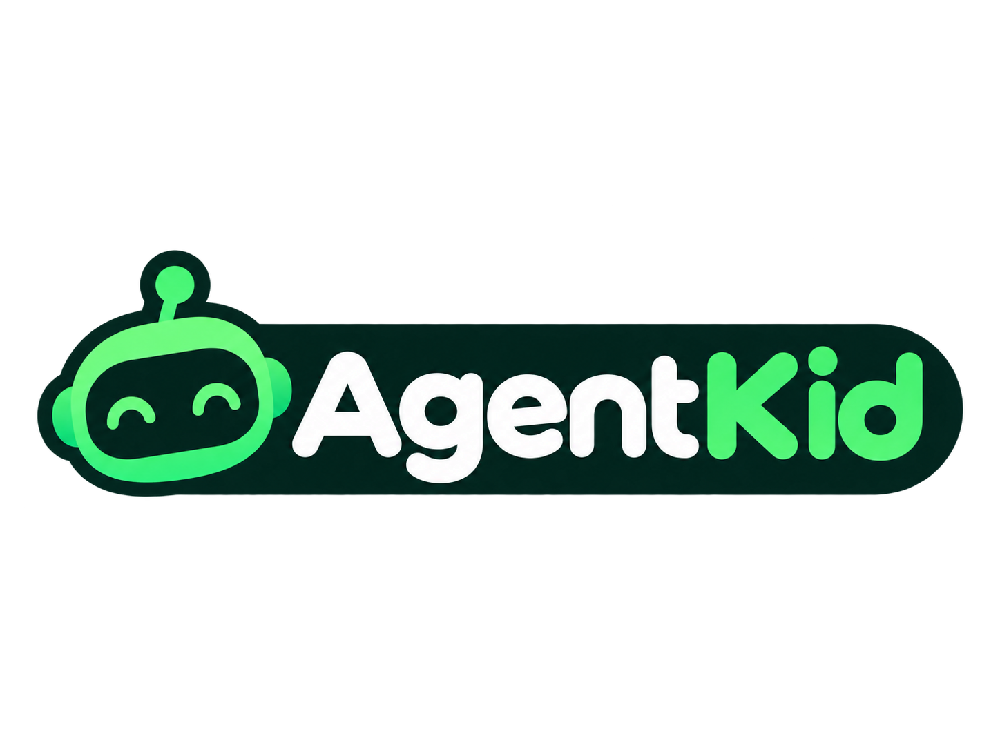
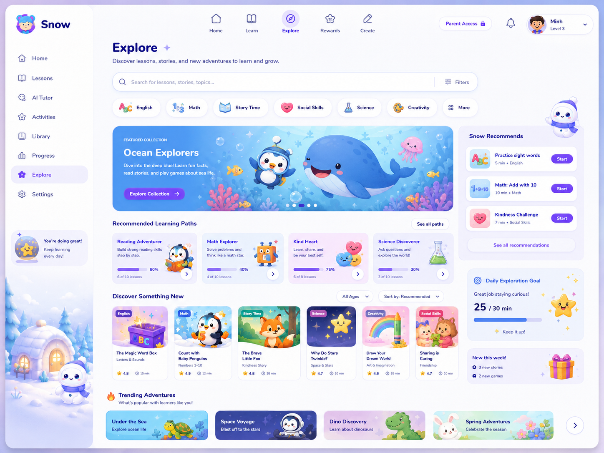
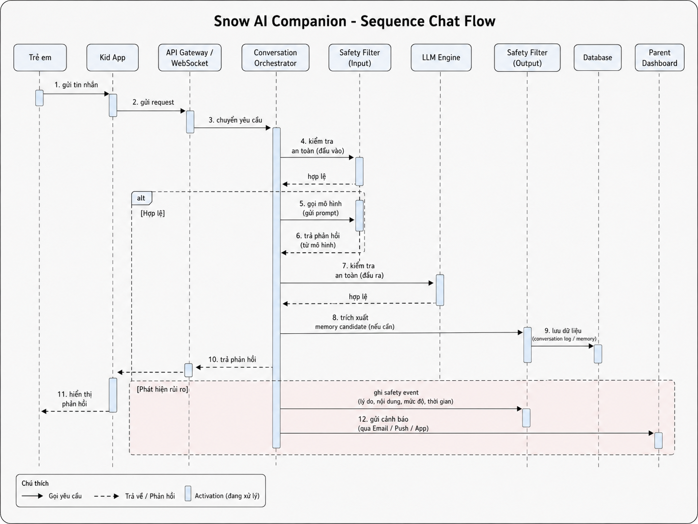
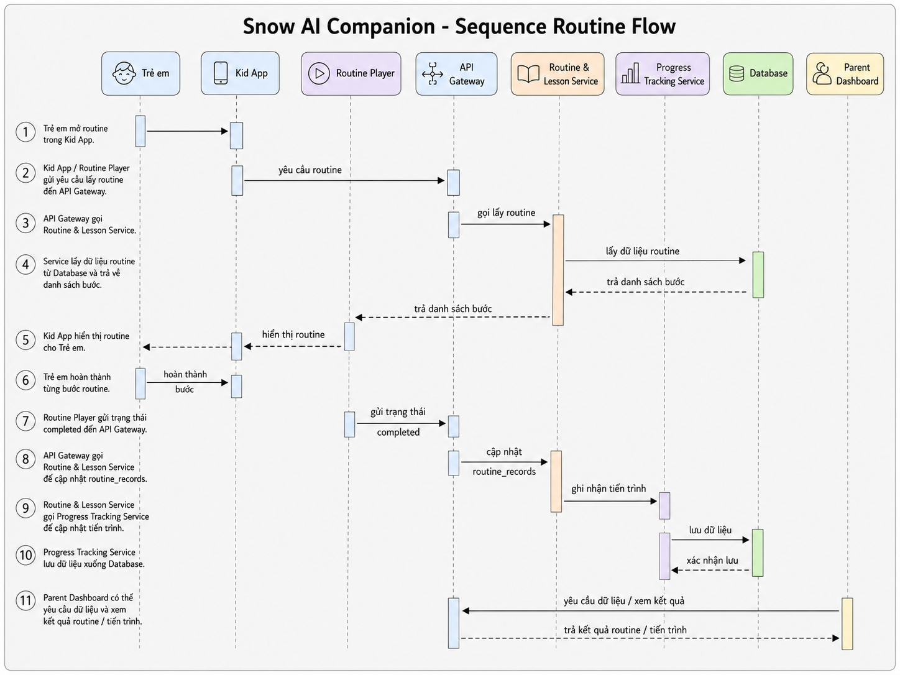
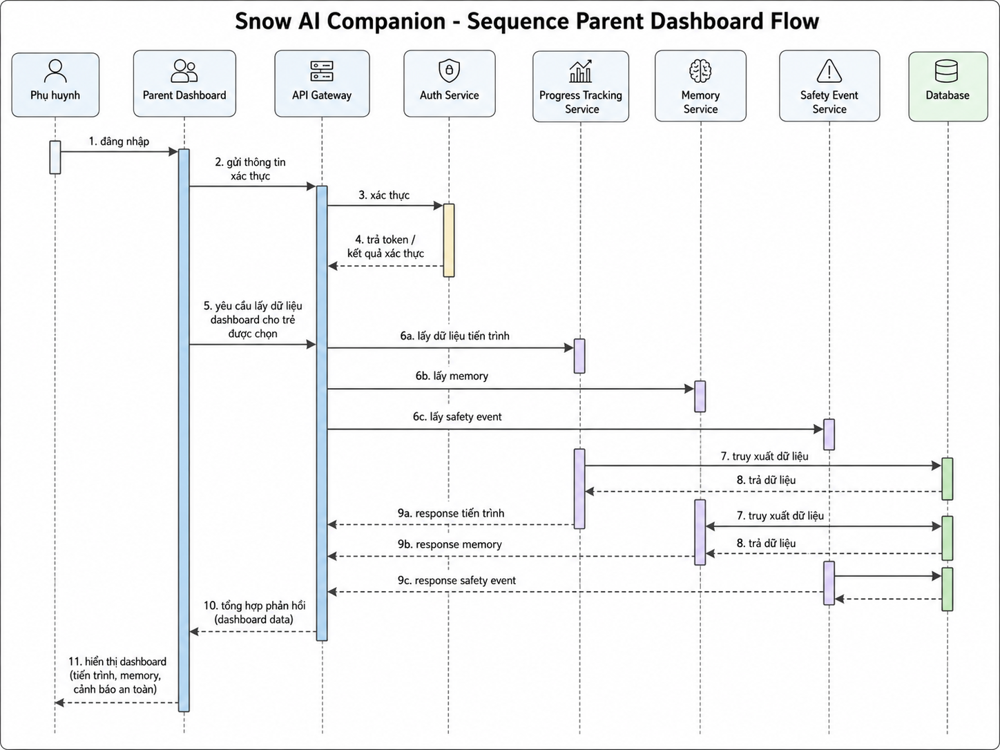
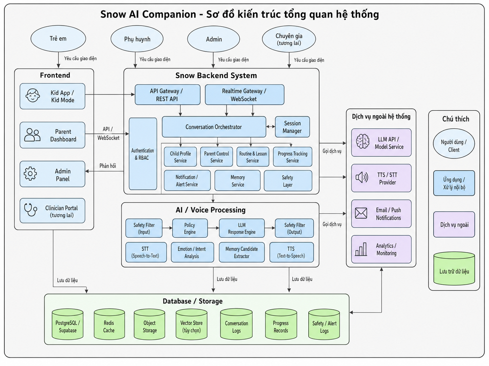
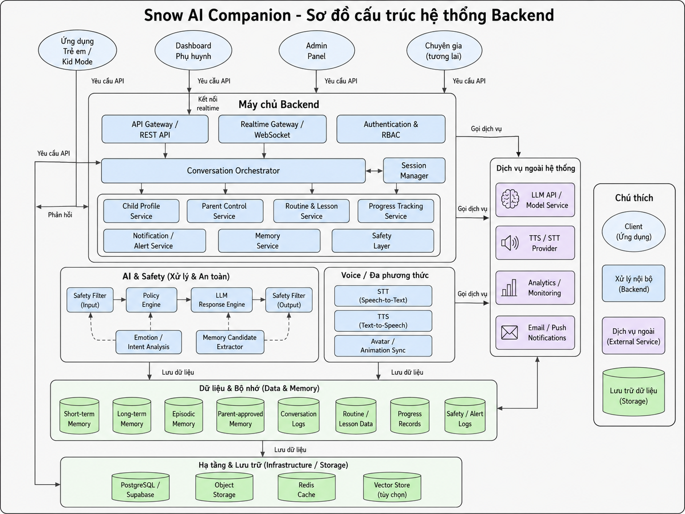
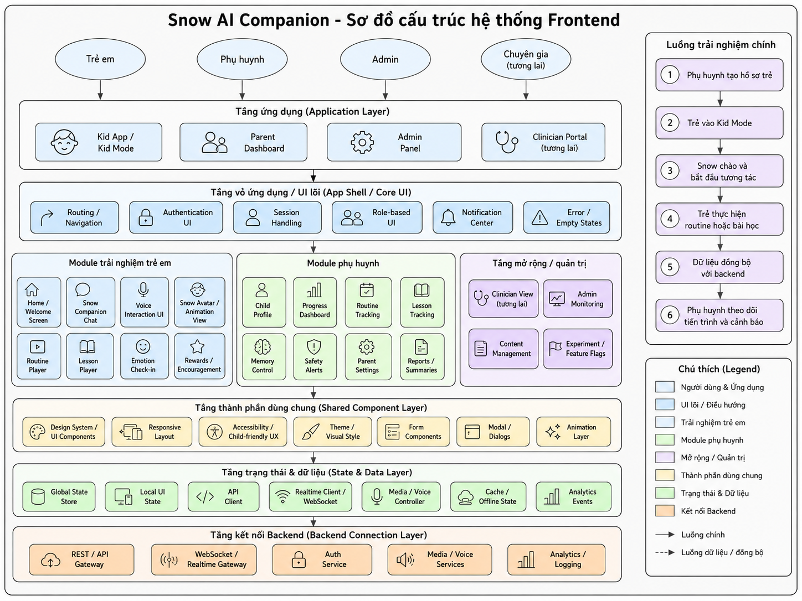
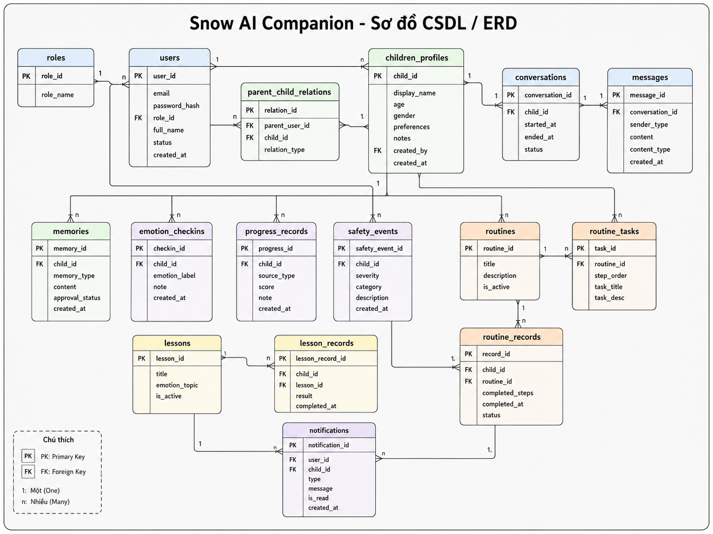
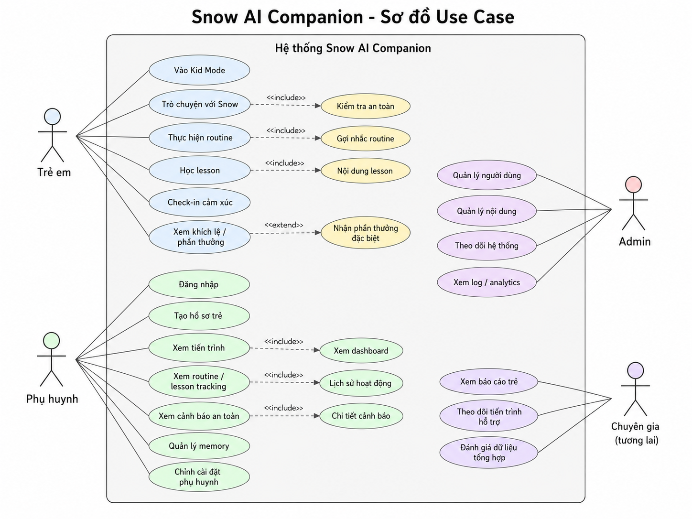

<div align="center">



[](https://github.com/kyoo-147/agentkid_snow)
[](https://github.com/kyoo-147/agentkid_snow/tree/legacy-before-snow-ui)
[](https://app.agentkid.io.vn/)

<p><strong>Preserved AgentKid architecture and monorepo foundation</strong></p>

Earlier product, API, domain, persistence, and safety-oriented implementation retained for reference and migration work.

[Current product](https://github.com/kyoo-147/agentkid_snow) · [Architecture](#system-architecture) · [Repository layout](#repository-layout) · [Local development](#local-development)

</div>

# Snow AI Companion — Legacy Foundation

> **Branch notice:** this is the preserved `legacy-before-snow-ui` branch. It is not the source currently deployed at `app.agentkid.io.vn`. Use `main` for the current Snow UI and `landing-page` for the production marketing website.



**Snow AI Companion** is a child-safe AI companion product foundation for children who need structured, gentle, and supervised interaction support.

The product focuses on controlled AI conversation, daily routine support, parent oversight, and safety-first system architecture. It is especially oriented toward early research with children in Vietnam, Australia, and similar real-world evaluation contexts.

Repository: <https://github.com/kyoo-147/agentkid_snow>

## Why Snow Exists

General-purpose chatbots are too open-ended for children, especially children who need predictable, low-pressure, and structured interaction.

Snow explores a different product shape:

- child-facing interaction should be gentle and bounded
- parents need visibility and control
- AI should stay inside approved topics and safe response patterns
- routines should be predictable and repeatable
- memory should be limited, explainable, and parent-governed
- the product should support research and evaluation before broad deployment

The core idea is not to replace caregivers or therapists. Snow is a controlled companion surface that can help children practice communication, routines, and emotional check-ins under supervision.

## Current Product Direction

Snow is being developed as a safe AI companion platform with:

- child-friendly companion UI
- structured chat flow
- routine support flow
- parent dashboard flow
- parent-approved topics
- safety guardrails
- controlled memory
- backend and frontend architecture for long-term product development
- research and pilot evaluation with children and families

The current product interface has moved to `main`. This branch remains available because its API, domain, database, architecture, and safety work may still inform future integration.

## Visual Overview

### Main Product Screen


The interface is designed around a calm child-facing experience, with simplified actions and a companion-centered interaction model.

### Chat Flow



The chat flow is not intended to be an unrestricted open chatbot.

It is designed around:

- approved topics
- safe prompt policy
- child-friendly tone
- context boundaries
- parent visibility
- fallback behavior when the model should not answer

### Routine Flow



Routine support is a key product wedge. The system can guide a child through predictable steps such as morning routines, study habits, emotional check-ins, or simple daily tasks.

The goal is to reduce friction through repetition and structure, not to generate surprising or overly creative AI behavior.

### Parent Dashboard Flow



The parent dashboard is the control plane for:

- child profile setup
- approved topics
- routine configuration
- session visibility
- safety limits
- alerts and summaries
- review of important interaction patterns

## System Architecture



Snow separates the product into child experience, parent control, domain logic, AI orchestration, and persistence layers.

The high-level architecture includes:

- **Child UI:** guided chat, routines, companion interaction, and feedback states.
- **Parent UI:** dashboard, configuration, visibility, and safety controls.
- **API layer:** session, profile, routine, and reporting endpoints.
- **Domain layer:** child profile, parent ownership, routine rules, safety policy, and consent boundaries.
- **AI layer:** prompt policy, guardrails, context limits, response checks, and provider boundary.
- **Data layer:** PostgreSQL-backed persistence, migrations, ownership checks, and audit-friendly records.

### Backend Architecture



The backend is organized for product safety and maintainability:

- domain packages define core business rules
- database packages own schema and migrations
- prompts package owns AI prompt contracts
- integrations package isolates external providers
- observability package supports future monitoring and review

### Frontend Architecture



The frontend separates public, parent, and child-facing surfaces. This keeps the child experience simple while preserving richer configuration tools for parents.

### ERD



The data model is built around parent ownership, child profiles, sessions, routines, and future reporting/alerting entities.

### Use Cases



Core use cases include:

- parent creates and manages a child profile
- parent configures topics and routines
- child starts a guided companion session
- AI responds inside bounded safety rules
- parent reviews summaries, routines, and important events

## Repository Layout

```text
apps/web/          Web product surface and prototype routes
apps/admin/        Admin-oriented surface for future operations
apps/worker/       Worker jobs and async processing boundary
packages/domain/   Product domain contracts and business logic
packages/database/ Database schema, migrations, and persistence helpers
packages/prompts/  AI prompt contracts and safety prompt surfaces
packages/ui/       Shared UI primitives
packages/testing/  Test helpers
docs/              Architecture, decisions, and archived planning notes
docs/images/       Product and architecture visuals used by this README
tasks/             Task lifecycle and implementation tracking
```

## Current Implementation Status

Implemented or scaffolded in this repository:

- Next.js web app foundation
- public marketing surface
- login UI
- static parent dashboard UI shell
- child-facing session prototype route
- canonical product and architecture documents
- PostgreSQL schema and migration foundation
- parent/child profile prototype flows
- session shell and media hooks spike
- documentation checks and database schema checks

Still pending or private/in progress:

- newest private product implementation
- production authentication
- full AI provider integration
- production-grade child safety review loop
- worker jobs and alerts
- full reporting layer
- real deployment telemetry
- field-test reporting and research summaries

## Research And Pilot Direction

This branch documents research questions intended for future supervised evaluation. It does not by itself prove completed field testing, clinical validation, or production safety.

The key research questions are:

- Does the child understand and accept the companion interaction?
- Are routines easier to follow with a structured companion?
- Can parents configure useful boundaries without too much complexity?
- Are AI responses predictable, safe, and emotionally appropriate?
- Which interaction patterns should be blocked, escalated, or summarized?

## Local Development

This branch uses a pnpm monorepo and PowerShell-based workspace scripts.

```powershell
git clone --branch legacy-before-snow-ui https://github.com/kyoo-147/agentkid_snow.git
cd agentkid_snow
corepack enable
pnpm install --frozen-lockfile
pnpm run build
```

Common checks:

```powershell
pnpm run lint
pnpm run test
pnpm run typecheck
pnpm run check:docs
pnpm run check:database-schema
```

## Notes For Readers

Snow is a child-facing AI project, so the important work is not only UI or model prompting. The hard parts are product boundaries, safety policies, parent oversight, data handling, and evaluation with real users.

This branch should be read as a product and architecture foundation. Current visual product development lives on `main`; the production marketing website lives on `landing-page`.

## Repository Branches

| Branch | Purpose |
| --- | --- |
| `main` | Current Snow UI deployed to `app.agentkid.io.vn` |
| `landing-page` | Bilingual static website deployed to `agentkid.io.vn` |
| `legacy-before-snow-ui` | This preserved monorepo and architecture foundation |

## Security And Secrets

Do not commit credentials, child data, private evaluation records, production environment files, SSH keys, or certificates. Treat screenshots, transcripts, emotion records, audio, video, and session data as sensitive unless explicitly approved for publication.

## License

No repository-wide license is currently declared. All rights are reserved unless a file or bundled third-party component states otherwise. Review dependency and asset licenses before redistribution or commercial release.
