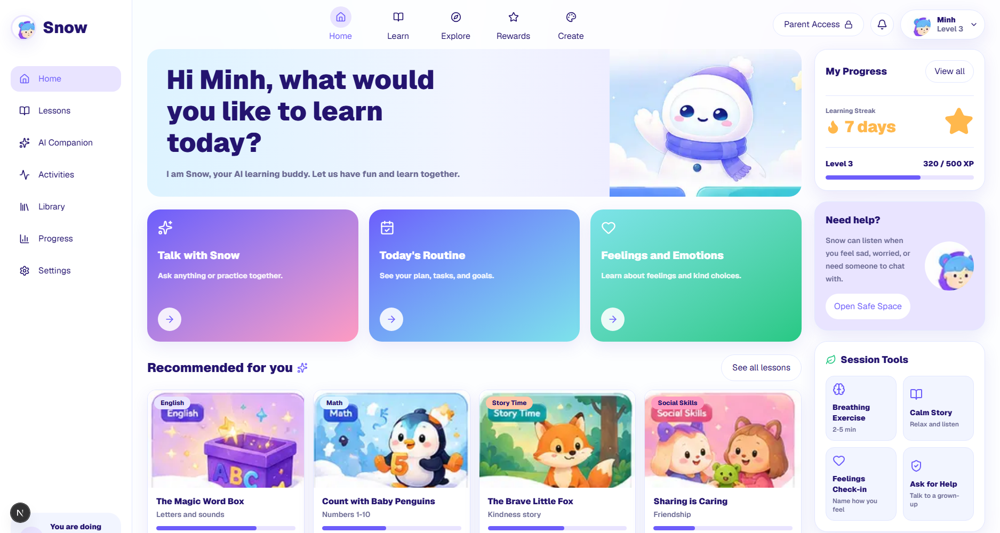
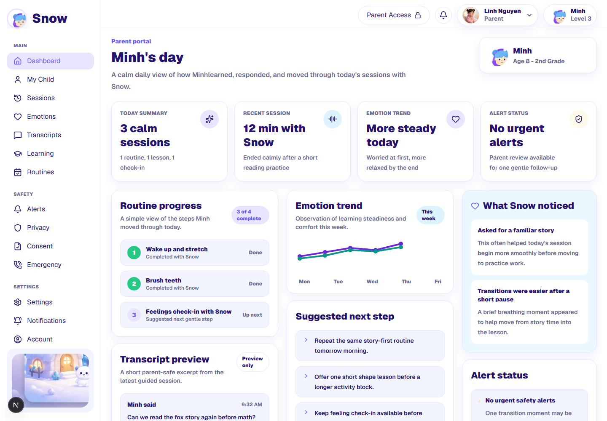
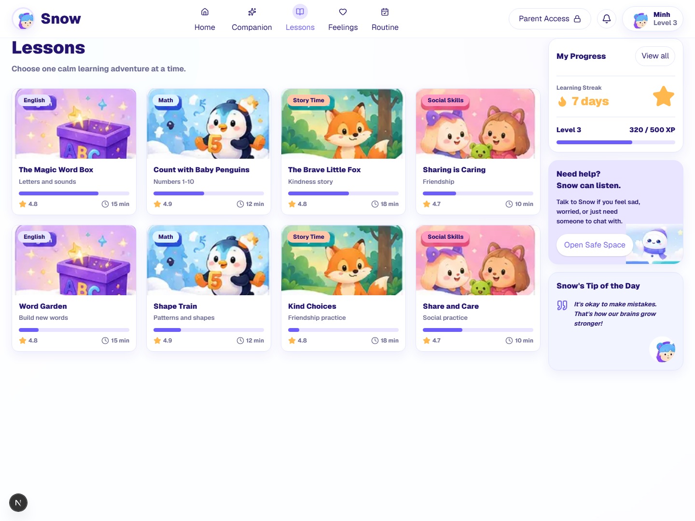
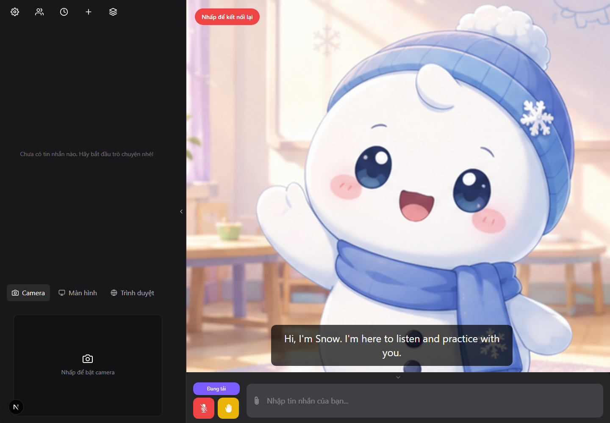

<div align="center">


[](https://app.agentkid.io.vn/)
[](https://app.agentkid.io.vn/parent)
[](https://agentkid.io.vn/)
[](https://nextjs.org/)
[](#project-status)

<p><strong>A calm, parent-guided AI learning companion for children</strong></p>

Child learning experiences, an AI companion surface, and clear caregiver oversight in one product interface.

[Live product](https://app.agentkid.io.vn/) · [Parent portal](https://app.agentkid.io.vn/parent) · [Quick start](#quick-start) · [Architecture](#architecture) · [Branch map](#repository-branches)

</div>

AgentKid Snow is the current product-interface repository for AgentKid. It combines child-facing learning flows, a character-led AI companion experience, parent dashboards, safety and privacy controls, and internal administration surfaces.

The interface is designed for young and neurodiverse learners who benefit from short prompts, visual choices, calm pacing, and predictable interaction. Parents and caregivers receive observational summaries and controls without clinical or diagnostic claims.

> **Project status:** `main` contains the UI currently deployed at `app.agentkid.io.vn`. The interface, routes, responsive layouts, mock data, and selected companion assets are available. Production authentication, authoritative persistence, live AI orchestration, and complete backend integration are not yet shipped in this branch.

## Product preview

### Child learning home



### Parent portal



### Lessons



### AI companion



The screenshots above show the current UI implementation. Displayed progress, sessions, observations, and alerts are demonstration data unless connected to an authoritative backend.

## What is available

### Child experience

- guided home and activity surfaces;
- lessons and one-step-at-a-time practice;
- routines, progress, rewards, library, and creative activities;
- AI companion, talk, and avatar routes;
- calm visual hierarchy and child-sized interaction targets.

### Parent portal

- daily dashboard and activity timeline;
- child profiles and session history;
- learning, routines, emotions, and transcript views;
- safety alerts and parent follow-up surfaces;
- privacy, consent, emergency, notification, and account settings.

### Administration

- product and runtime overview;
- companion configuration surface;
- system and vision-control screens;
- parent-safe language and explicit capability boundaries.

## Product boundaries

AgentKid is a support and learning product. It is not a medical device, therapist, diagnostic system, or replacement for parents, teachers, caregivers, or qualified professionals.

The current repository uses mock data for many screens. UI copy such as progress, emotion observations, alerts, and recommendations demonstrates product behavior; it is not evidence of live measurement or production AI analysis.

## Live environments

| Surface | URL | Source |
| --- | --- | --- |
| Product application | <https://app.agentkid.io.vn/> | `main` |
| Parent portal | <https://app.agentkid.io.vn/parent> | `main` |
| Marketing website | <https://agentkid.io.vn/> | `landing-page` |
| Vietnamese marketing page | <https://agentkid.io.vn/vi/> | `landing-page` |

## Quick start

### Requirements

- Node.js 20 or newer; Node.js 24 is used on the current VPS.
- npm 10 or newer.

### Clone and run

```bash
git clone https://github.com/kyoo-147/agentkid_snow.git
cd agentkid_snow
npm install
npm run dev
```

Open <http://localhost:3000>. The root route redirects to the parent dashboard.

Useful entry points:

```text
http://localhost:3000/parent
http://localhost:3000/session/home
http://localhost:3000/companion
http://localhost:3000/admin
```

### Production build

```bash
npm ci
npm run build
npm run start
```

The build uses Next.js standalone output. A standalone deployment must copy both `.next/static` and `public` beside the standalone server before startup.

## Scripts

| Command | Purpose |
| --- | --- |
| `npm run dev` | Start the Next.js development server |
| `npm run build` | Compile and type-check the production application |
| `npm run start` | Start the compiled Next.js application |
| `npm run lint` | Run ESLint across the repository |

`npm run build` is the authoritative compile gate for the current UI. Some imported third-party runtime assets still produce lint findings and require separate cleanup; do not describe lint as passing unless it has been run successfully on the exact revision.

## Architecture

```text
src/
├── app/
│   ├── (child)/             Child learning and companion routes
│   ├── (parent)/            Parent portal routes
│   ├── (admin)/             Administrative routes
│   ├── layout.tsx           Root metadata and application shell
│   └── page.tsx             Root redirect
├── components/
│   ├── admin/               Admin shells and controls
│   ├── app-shell/           Shared child application shell
│   ├── companion/           Companion-stage UI
│   ├── pages/               Page-level product screens
│   ├── parent/              Parent navigation and panels
│   └── ui/                  Shared UI primitives
├── data/                    Mock product records
├── lib/                     Formatting and shared utilities
├── styles/                  Design tokens
├── types/                   Product types
└── vtuber-app/              Adapted VTuber/Live2D reference implementation

public/
├── images/                  Product artwork and UI imagery
├── libs/                    Browser runtime assets for VAD, ONNX, and Live2D
└── mockups/                 Design references
```

The Next.js product shell is the active web application. `src/vtuber-app` and the bundled WebSDK preserve companion integration work and reference code; they should not be mistaken for a fully connected production voice runtime.

## Main routes

### Parent

```text
/parent
/parent/children
/parent/children/[childId]/sessions
/parent/children/[childId]/timeline
/parent/children/[childId]/transcripts
/parent/children/[childId]/learning
/parent/children/[childId]/routines
/parent/alerts
/parent/privacy
/parent/consent
/parent/settings
```

### Child and companion

```text
/session/home
/session/lessons
/session/activities
/session/explore
/session/library
/session/progress
/session/rewards
/session/routine
/companion
/companion/talk
/companion/avatar
```

### Admin

```text
/admin
/admin/companion
/admin/system
/admin/vision
```

## Repository branches

| Branch | Purpose |
| --- | --- |
| `main` | Current Snow UI deployed to `app.agentkid.io.vn` |
| `landing-page` | Static bilingual marketing website deployed to `agentkid.io.vn` |
| `legacy-before-snow-ui` | Preserved earlier AgentKid monorepo and architecture foundation |

To work only on the marketing website:

```bash
git clone --branch landing-page https://github.com/kyoo-147/agentkid_snow.git
cd agentkid_snow/landing-page
node scripts/server.mjs 8124
```

## Deployment

The current production application runs behind Nginx on a Linux VPS:

```text
Internet
  └── https://app.agentkid.io.vn
        └── Nginx + Let's Encrypt
              └── systemd
                    └── Next.js standalone server on 127.0.0.1:3001
```

Operational secrets, SSH keys, certificates, and VPS-specific environment files must remain outside Git. Never commit production credentials.

## Design and product documentation

- [`PRODUCT.md`](PRODUCT.md) — product purpose and user boundaries
- [`DESIGN.md`](DESIGN.md) — visual direction
- [`01_DESIGN.md`](01_DESIGN.md) — detailed design foundation
- [`05_ROUTE_MAP.md`](05_ROUTE_MAP.md) — intended route model
- [`06_AI_COMPANION_UI_SPEC.md`](06_AI_COMPANION_UI_SPEC.md) — companion surface specification
- [`09_ACCESSIBILITY.md`](09_ACCESSIBILITY.md) — accessibility guidance
- [`15_OPEN_LLM_VTUBER_COMPATIBILITY.md`](15_OPEN_LLM_VTUBER_COMPATIBILITY.md) — integration boundary

## Security and privacy

- Keep camera and microphone access opt-in and visible.
- Keep sensitive controls parent-only.
- Do not store raw child media without an explicit, reviewed product requirement.
- Do not present mock emotion or safety observations as clinical conclusions.
- Keep credentials and environment-specific evidence outside the repository.
- Review third-party assets and SDK licenses before redistribution or commercial release.

## Contributing

1. Create a focused branch from `main`.
2. Keep child, parent, and admin authority boundaries explicit.
3. Prefer small, reviewable changes.
4. Run the production build before opening a pull request.
5. Include screenshots for visual changes and clearly identify mock behavior.

## License

No repository-wide license is currently declared. All rights are reserved unless a file or bundled third-party component states otherwise. Third-party libraries and Live2D/WebSDK materials retain their own licenses and redistribution terms.
