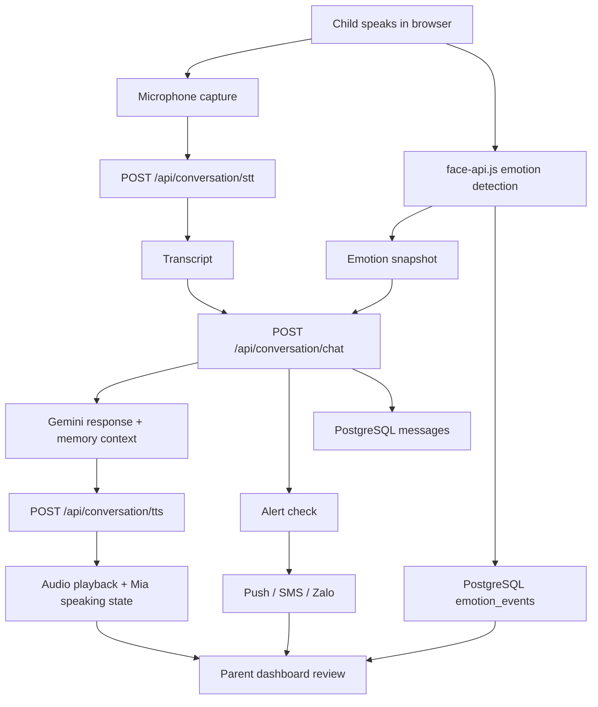

# AgentKid Architecture Notes

## System Boundaries
- Browser client handles session UI, media permissions, recording, playback, and on-device emotion detection.
- Next.js server routes handle orchestration to Google Cloud and privileged application logic.
- PostgreSQL Docker owns relational data and future vector memory retrieval.
- Auth is implemented or integrated separately and mapped to parent profiles server-side.
- External providers handle STT, TTS, LLM, SMS, and Zalo delivery.

## Main Runtime Flow

## Data Responsibilities
- Browser never sends raw video for storage in MVP.
- Emotion detection stays client-side and only derived emotion records are persisted.
- Session transcript is stored as messages, not as a single opaque blob.
- Long-term memory is a distilled fact layer, not a raw transcript archive.

## Implementation Boundaries
- `apps/web`: Next.js app, UI components, hooks, BFF route handlers, client auth UI, dashboard.
- `apps/worker`: async jobs, retries, memory extraction, scoring, and alert processing.
- `packages/database`: PostgreSQL schema, migrations, ownership helpers, seeds, and typed access helpers.

## Non-Functional Priorities
- Low latency for voice loop.
- Clear parent ownership and authorization.
- Privacy-first handling of child session data.
- Graceful degradation when Zalo or SMS is unavailable.
