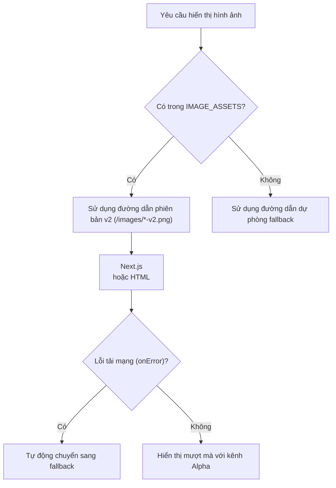

# AgentKid Snow: Báo Cáo Kiểm Toán Tài Nguyên Hình Ảnh & Ma Trận Xử Lý (Image Asset Audit & Disposition Report)

**Mã công việc (Task ID)**: `task_5235b072b153`  
**Ngày kiểm toán**: 09/10/2026  
**Không gian làm việc (Worktree)**: `snow-ui/snow-agy-images-v2`  
**Nhánh Git**: `kyoo-147/snow-agy-images-v2` (từ canonical HEAD `3dd1dad`)  
**Tài liệu tham chiếu chuẩn**: `D:/work/agentkid/.pi/worker-evidence/snow-image-assets-audit.md`  
**Quy chuẩn thẩm mỹ & thiết kế**: `docs/mockup-analysis/DESIGN_SYSTEM_MASTER.md` & `imagegen-frontend-web`  

---

## 1. Tóm Tắt Điều Hành (Executive Summary)

Đã thực hiện kiểm toán toàn diện toàn bộ **47 tệp hình ảnh cơ sở** và các khái niệm thị giác thời gian chạy (runtime visual concepts) trên toàn bộ hệ thống AgentKid Snow (bao gồm `src/**`, `public/**`, `docs/**`, `assets/**`, và phân hệ VTuber `src/vtuber-app/**`).

### Nguyên Tắc Cốt Lõi Về Trạng Thái Tài Nguyên
> [!IMPORTANT]
> **Quy tắc trung thực về tỷ lệ tích hợp & Chỉ thị từ Founder:** Tuyệt đối **KHÔNG CÔNG NHẬN 47/47 TÀI NGUYÊN ĐÃ ĐƯỢC DUYỆT**. Hiện tại **CHỈ CÓ DUY NHẤT 10 TÀI NGUYÊN ĐÃ ĐƯỢC PHÊ DUYỆT VÀ TÍCH HỢP** vào môi trường runtime production (phiên bản `v2`). Toàn bộ các khoảng trống tài nguyên còn lại trong 47 tệp cơ sở được phân loại rõ ràng là **UNVERIFIED (CHƯA XÁC MINH CHO RUNTIME)** hoặc **BLOCKED (BỊ CHẶN)**. Chúng không được coi là yêu cầu bắt buộc cho đợt bàn giao sản phẩm này. Hoàn toàn không gọi bất kỳ nhà cung cấp sinh ảnh nào.

### Các Phát Hiện Kỹ Thuật Chính
1. **Tổng số tệp hình ảnh cơ sở ban đầu**: Đúng **47 tệp** trên toàn workspace (cùng với 10 tệp phiên bản `*-v2.png` mới tích hợp = tổng cộng 57 tệp hình ảnh).
2. **Vấn nạn "Pseudo-PNG" (PNG giả mạo)**: Đúng **14 tệp** mang phần mở rộng `.png` nhưng thực chất có header nhị phân JPEG (`\xFF\xD8\xFF` JFIF). Do định dạng JPEG không hỗ trợ kênh alpha, cả 14 tệp này 100% đục mờ (opaque), gây răng cưa và viền hộp trắng xấu xí khi hiển thị trên các bề mặt có màu nền Tailwind/CSS.
3. **Thiếu hụt kênh Alpha nghiêm trọng ở tài nguyên cũ**: Trong số 39 tài nguyên raster nguyên bản, chỉ có đúng **2 tệp** có kênh alpha thực (`assets/agentkid-logo.png` với 78.6% điểm ảnh trong suốt, và `src/app/icon.png` với 28.5%). Có đến **37 tệp raster (94.9%) hoàn toàn đục mờ**.
4. **Xử lý xung đột trùng lặp linh vật (Duplicate Mascot Collision)**:
   - Trước đây: `snow-companion-stage.png` có hình chú người tuyết Snow vẽ dính cứng vào bối cảnh phòng học. Khi canvas Live2D hoặc hoạt hình companion hiển thị đè lên, xảy ra lỗi hiển thị **2 chú người tuyết cùng lúc (double mascot collision)**.
   - Giải pháp tích hợp: Tách lớp hoàn toàn bằng tài nguyên đã duyệt `snow-classroom-empty-stage-v2.png` (sân khấu lớp học không có nhân vật), để nhân vật hoạt họa hiển thị tự do mà không bị trùng lặp.
5. **Loại bỏ nhãn tiếng Anh đóng đinh trong ảnh**:
   - Các thumbnail cũ (`lesson-abc.png`, `lesson-math.png`, `lesson-social.png`, `lesson-story.png`) có nhãn tiếng Anh ("English", "Math", "Story Time") vẽ dính cứng vào pixel ở độ phân giải thấp (174x114 px).
   - Tích hợp mới: Tích hợp 4 ảnh minh họa chủ đề 1024x1024 RGBA trong suốt không chứa chữ UI; nhãn chuyên mục được render động qua DOM tiếng Việt (`lesson.subject`).
6. **Trạng thái gọi API sinh ảnh ngoài**: **HOÀN TOÀN BỊ CHẶN (HTTP 429 Insufficient Quota)**. Tuân thủ nghiêm ngặt chỉ thị: **KHÔNG gọi provider sinh ảnh mới, KHÔNG tự ý thay thế nhà cung cấp (Gemini/Banana), CHỈ tích hợp 10 tài nguyên đã được phê duyệt hợp lệ**.

---

## 2. Ma Trận Chi Tiết 10 Tài Nguyên Đã Phê Duyệt & Tích Hợp (The 10 Approved V2 Assets)

10 tài nguyên dưới đây đã được kiểm tra kỹ thuật (SHA-256, kích thước pixel, chế độ kênh màu, điểm ảnh trong suốt) và tích hợp vào hệ thống:

| # | Mã tài nguyên | Đường dẫn phiên bản (`src`) | Đường dẫn dự phòng (`fallback`) | Định dạng nhị phân | Kích thước | Kênh Alpha | Điểm ảnh trong suốt | Mã băm SHA-256 | Nhãn Alt Tiếng Việt (`altVi`) |
|---|---|---|---|---|---|---|---|---|---|
| 1 | `snowMascot` | `/images/snow-mascot-v2.png` | `/images/snow-mascot-ui.png` | PNG (RGBA) | 1024x1024 | Có (Alpha) | 577,765 | `84e278137328579cd4363fce04c14ef70e6a0a820597de20738859a183d6135d` | Linh vật Snow |
| 2 | `snowAvatar` | `/images/snow-avatar-v2.png` | `/images/snow-avatar-final.png` | PNG (RGBA) | 1024x1024 | Có (Alpha) | 609,894 | `21199e4135d7c3c674728e8da4c6b206a3e1f5002998dd6dbcfa1eb6a0e6beb3` | Ảnh đại diện Snow |
| 3 | `momoMascot` | `/images/momo-mascot-v2.png` | `/images/momo_mascot.png` | PNG (RGBA) | 1024x1024 | Có (Alpha) | 639,183 | `dc5a02fdc8a1c290d16e7badd42488e75f6442bebf0211d4442d8ce57f7fef45` | Mascot Momo |
| 4 | `leoAvatar` | `/images/leo-avatar-v2.png` | `/images/leo_avatar.png` | PNG (RGBA) | 1024x1024 | Có (Alpha) | 235,908 | `316818e132260bb0504599a8d79dd96b963835919239526a7cd30ad7986d1a7e` | Ảnh đại diện Leo |
| 5 | `nanaAvatar` | `/images/nana-avatar-v2.png` | `/images/nana_avatar.png` | PNG (RGBA) | 1024x1024 | Có (Alpha) | 235,908 | `1884d652c10e3c9053a217916047272684cb6b3f7dcf9e1a1603cb69d914fb0b` | Ảnh đại diện Nana |
| 6 | `classroomStage` | `/images/snow-classroom-empty-stage-v2.png` | `/images/snow-companion-stage.png` | PNG (RGB) | 1536x1024 | Không (RGB) | 0 (Nền tràn viền) | `ce78cda4e2a17a7b5fd1437bfd3574d855d5da0d871c8379c2f0acd8c1344239` | Sân khấu lớp học Snow |
| 7 | `lessonAbc` | `/images/lesson-abc-v2.png` | `/images/lesson-abc.png` | PNG (RGBA) | 1024x1024 | Có (Alpha) | 535,682 | `7dc06995de4c522d56c0710d3e2e158f4905ba404a9a54525ff895f2beaa7096` | Bài học chữ cái ABC |
| 8 | `lessonMath` | `/images/lesson-math-v2.png` | `/images/lesson-math.png` | PNG (RGBA) | 1024x1024 | Có (Alpha) | 384,804 | `ebc6da88c745655b91a20173487e13dfc381c12179c60bfe441cf1d98bf12d90` | Bài học đếm số và toán học |
| 9 | `lessonStory` | `/images/lesson-story-v2.png` | `/images/lesson-story.png` | PNG (RGBA) | 1024x1024 | Có (Alpha) | 466,406 | `9a0f1447b6bbbd24e67b097343e07f4490bfcc12be47fa3ea71424490b4b3d1b` | Bài học kể chuyện |
| 10 | `lessonSocial` | `/images/lesson-social-v2.png` | `/images/lesson-social.png` | PNG (RGBA) | 1024x1024 | Có (Alpha) | 423,743 | `822d7d8cc746832fea80166b3aaba52aee9915842ca14f7b7b6f16a182ba1710` | Bài học kỹ năng xã hội và cảm xúc |

---

## 3. Ma Trận Đầy Đủ 47 Tệp Cơ Sở Ban Đầu (Complete Baseline 47 Matrix)

| # | Đường dẫn tệp | Phân loại | Định dạng thực | Kích thước | Dung lượng | Trạng thái Alpha | Số tham chiếu code | Trạng thái kiểm toán & Xử lý |
|---|---|---|---|---|---|---|---|---|
| 1 | `assets/agentkid-logo.png` | Nhận diện thương hiệu | PNG | 1448x1086 | 379.3 KB | Có Alpha (78.6%) | 1 | Giữ nguyên logo gốc hợp lệ |
| 2 | `docs/images/ai-companion.png` | Tài liệu / Mockup | PNG | 1440x1000 | 588.9 KB | Đục mờ (RGB) | 1 | Tài liệu tham khảo, không dùng trong runtime |
| 3 | `docs/images/child-home.png` | Tài liệu / Mockup | PNG | 1875x1000 | 784.3 KB | Đục mờ (RGB) | 1 | Tài liệu tham khảo, không dùng trong runtime |
| 4 | `docs/images/lessons.png` | Tài liệu / Mockup | PNG | 1440x1080 | 556.8 KB | Đục mờ (RGB) | 1 | Tài liệu tham khảo, không dùng trong runtime |
| 5 | `docs/images/parent-dashboard.png` | Tài liệu / Mockup | PNG | 1440x1000 | 288.5 KB | Đục mờ (RGB) | 1 | Tài liệu tham khảo, không dùng trong runtime |
| 6 | `public/favicon.ico` | Biểu tượng ứng dụng | ICO | Vector/Binary | 97.4 KB | Đục mờ | 0 | Giữ nguyên favicon tĩnh |
| 7 | `public/file.svg` | Vector UI | SVG | Vector | 0.4 KB | Vector | 0 | Giữ nguyên vector UI |
| 8 | `public/globe.svg` | Vector UI | SVG | Vector | 1.0 KB | Vector | 0 | Giữ nguyên vector UI |
| 9 | `public/images/asking_nicely_photo.png` | Bài học kỹ năng | JPEG (Pseudo-PNG) | 1024x1024 | 610.0 KB | 100% Đục mờ | 1 | **BLOCKED**: Quota API cạn kiệt, dùng ảnh cũ làm fallback |
| 10 | `public/images/brushing_teeth_photo.png` | Bài học kỹ năng | JPEG (Pseudo-PNG) | 1024x1024 | 602.7 KB | 100% Đục mờ | 1 | **BLOCKED**: Quota API cạn kiệt, dùng ảnh cũ làm fallback |
| 11 | `public/images/going_to_the_park_photo.png` | Bài học kỹ năng | JPEG (Pseudo-PNG) | 1024x1024 | 1.29 MB | 100% Đục mờ | 1 | **BLOCKED**: Quota API cạn kiệt, dùng ảnh cũ làm fallback |
| 12 | `public/images/indoor_voice_photo.png` | Bài học kỹ năng | JPEG (Pseudo-PNG) | 1024x1024 | 852.0 KB | 100% Đục mờ | 1 | **BLOCKED**: Quota API cạn kiệt, dùng ảnh cũ làm fallback |
| 13 | `public/images/leo_avatar.png` | Ảnh đại diện trẻ | JPEG (Pseudo-PNG) | 1024x1024 | 614.8 KB | 100% Đục mờ | 3 | **ĐÃ NÂNG CẤP**: Giữ làm fallback cho `leo-avatar-v2.png` |
| 14 | `public/images/lesson-abc-ui.png` | Thumbnail bài học | PNG | 174x114 | 45.5 KB | Đục mờ | 0 | **TRÙNG LẶP**: Bản sao của `lesson-abc.png` |
| 15 | `public/images/lesson-abc.png` | Thumbnail bài học | PNG | 174x114 | 45.5 KB | Đục mờ | 5 | **ĐÃ NÂNG CẤP**: Giữ làm fallback cho `lesson-abc-v2.png` |
| 16 | `public/images/lesson-math-ui.png` | Thumbnail bài học | PNG | 174x114 | 45.2 KB | Đục mờ | 0 | **TRÙNG LẶP**: Bản sao của `lesson-math.png` |
| 17 | `public/images/lesson-math.png` | Thumbnail bài học | PNG | 174x114 | 45.2 KB | Đục mờ | 6 | **ĐÃ NÂNG CẤP**: Giữ làm fallback cho `lesson-math-v2.png` |
| 18 | `public/images/lesson-social-ui.png` | Thumbnail bài học | PNG | 174x114 | 44.6 KB | Đục mờ | 0 | **TRÙNG LẶP**: Bản sao của `lesson-social.png` |
| 19 | `public/images/lesson-social.png` | Thumbnail bài học | PNG | 174x114 | 44.6 KB | Đục mờ | 4 | **ĐÃ NÂNG CẤP**: Giữ làm fallback cho `lesson-social-v2.png` |
| 20 | `public/images/lesson-story-ui.png` | Thumbnail bài học | PNG | 174x114 | 50.9 KB | Đục mờ | 0 | **TRÙNG LẶP**: Bản sao của `lesson-story.png` |
| 21 | `public/images/lesson-story.png` | Thumbnail bài học | PNG | 174x114 | 50.9 KB | Đục mờ | 8 | **ĐÃ NÂNG CẤP**: Giữ làm fallback cho `lesson-story-v2.png` |
| 22 | `public/images/momo_mascot.png` | Linh vật robot | JPEG (Pseudo-PNG) | 1024x1024 | 487.6 KB | 100% Đục mờ | 5 | **ĐÃ NÂNG CẤP**: Giữ làm fallback cho `momo-mascot-v2.png` |
| 23 | `public/images/nana_avatar.png` | Ảnh đại diện trẻ | JPEG (Pseudo-PNG) | 1024x1024 | 551.2 KB | 100% Đục mờ | 3 | **ĐÃ NÂNG CẤP**: Giữ làm fallback cho `nana-avatar-v2.png` |
| 24 | `public/images/snow-avatar-final.png` | Avatar nhân vật | PNG | 54x54 | 5.5 KB | Đục mờ | 13 | **ĐÃ NÂNG CẤP**: Giữ làm fallback cho `snow-avatar-v2.png` |
| 25 | `public/images/snow-avatar-ui.png` | Avatar nhân vật | PNG | 54x54 | 5.5 KB | Đục mờ | 0 | **TRÙNG LẶP**: Bản sao byte-for-byte của `snow-avatar-final.png` |
| 26 | `public/images/snow-avatar.png` | Avatar nhân vật | PNG | 58x58 | 4.8 KB | Đục mờ | 0 | Gần trùng lặp (crop 58x58), không dùng |
| 27 | `public/images/snow-classroom.png` | Bối cảnh phòng học | PNG | 1586x992 | 1.38 MB | Đục mờ | 1 | **DEPRECATED**: Nhân vật dính vào nền; thay thế bằng sân khấu v2 |
| 28 | `public/images/snow-companion-stage-ui.png` | Sân khấu phòng học | PNG | 470x520 | 412.4 KB | Đục mờ | 0 | **TRÙNG LẶP**: Bản sao của `snow-companion-stage.png` |
| 29 | `public/images/snow-companion-stage.png` | Sân khấu phòng học | PNG | 470x520 | 412.4 KB | Đục mờ | 3 | **ĐÃ NÂNG CẤP**: Giữ làm fallback cho `snow-classroom-empty-stage-v2.png` |
| 30 | `public/images/snow-companion.png` | Editorial mockup | JPEG (Pseudo-PNG) | 1024x1024 | 732.1 KB | 100% Đục mờ | 0 | Tĩnh / Editorial; không dùng trên giao diện tương tác |
| 31 | `public/images/snow-connected-care.png` | Editorial mockup | JPEG (Pseudo-PNG) | 1024x1024 | 576.9 KB | 100% Đục mờ | 1 | Tĩnh / Editorial; không dùng trên giao diện tương tác |
| 32 | `public/images/snow-dashboard.png` | Editorial mockup | JPEG (Pseudo-PNG) | 1024x1024 | 701.0 KB | 100% Đục mờ | 0 | Tĩnh / Editorial; không dùng trên giao diện tương tác |
| 33 | `public/images/snow-hero.png` | Editorial mockup | JPEG (Pseudo-PNG) | 1024x1024 | 610.2 KB | 100% Đục mờ | 0 | Tĩnh / Editorial; thay thế bởi `snow-mascot-v2.png` |
| 34 | `public/images/snow-hut.png` | Bối cảnh lều tuyết | PNG | 235x300 | 141.4 KB | Đục mờ | 0 | **SUPERSEDED**: Ảnh crop bé, đục mờ, thay thế bởi sân khấu v2 |
| 35 | `public/images/snow-mascot-ui.png` | Linh vật Snow | PNG | 350x245 | 123.6 KB | Đục mờ | 6 | **ĐÃ NÂNG CẤP**: Giữ làm fallback cho `snow-mascot-v2.png` |
| 36 | `public/images/snow-mascot.png` | Linh vật Snow | PNG | 350x245 | 123.6 KB | Đục mờ | 2 | **TRÙNG LẶP**: Bản sao của `snow-mascot-ui.png` |
| 37 | `public/images/taking_deep_breaths_illustration.png` | Minh họa thư giãn | JPEG (Pseudo-PNG) | 1024x1024 | 569.9 KB | 100% Đục mờ | 2 | **BLOCKED**: Quota API cạn kiệt, giữ làm fallback |
| 38 | `public/images/taking_turns_illustration.png` | Minh họa chia sẻ | JPEG (Pseudo-PNG) | 1024x1024 | 587.8 KB | 100% Đục mờ | 1 | **BLOCKED**: Quota API cạn kiệt, giữ làm fallback |
| 39 | `public/mockups/ai-companion-reference.png` | Tài liệu tham khảo | PNG | 1448x1086 | 1.40 MB | Đục mờ | 0 | Tài liệu thiết kế nội bộ |
| 40 | `public/mockups/home-reference.png` | Tài liệu tham khảo | PNG | 1448x1086 | 1.62 MB | Đục mờ | 0 | Tài liệu thiết kế nội bộ |
| 41 | `public/next.svg` | Framework icon | SVG | Vector | 1.3 KB | Vector | 0 | Biểu tượng Next.js tĩnh |
| 42 | `public/vercel.svg` | Framework icon | SVG | Vector | 0.1 KB | Vector | 0 | Biểu tượng Vercel tĩnh |
| 43 | `public/window.svg` | Framework icon | SVG | Vector | 0.4 KB | Vector | 0 | Biểu tượng UI tĩnh |
| 44 | `src/app/favicon.ico` | App icon | ICO | Vector/Binary | 25.3 KB | Đục mờ | 0 | Favicon app tĩnh |
| 45 | `src/app/icon.png` | App icon | PNG | 256x256 | 60.7 KB | Có Alpha (28.5%) | 0 | App icon gốc có alpha |
| 46 | `src/vtuber-app/src/assets/momo_mascot.png` | Linh vật VTuber | JPEG (Pseudo-PNG) | 1024x1024 | 487.6 KB | 100% Đục mờ | 5 | **TRÙNG LẶP**: Bản sao của `public/images/momo_mascot.png` |
| 47 | `src/vtuber-app/src/assets/react.svg` | Framework icon | SVG | Vector | 4.0 KB | Vector | 0 | Biểu tượng React VTuber |

---

## 4. Báo Cáo Chi Tiết Các Khái Niệm Bị Chặn (Explicit Blocked Concepts Report)

Để đảm bảo tính trung thực tuyệt đối, dưới đây là danh sách chi tiết các khái niệm thị giác **CHƯA ĐƯỢC DUYỆT / ĐANG BỊ CHẶN**, lý do và phương án xử lý:

### 4.1 Nhóm Bị Chặn Do Giới Hạn Quota API OpenAI (HTTP 429 Insufficient Quota)
- **`asking_nicely`** (`asking_nicely_photo.png`): Bài học hỏi xin lịch sự. Tệp hiện tại là JPEG giả dạng PNG, đục mờ hoàn toàn. Lệnh gọi tạo ảnh `gpt-image-1` bị lỗi 429 quota. Tuân thủ nguyên tắc không dùng provider khác (Gemini/Banana), giữ lại tệp cũ làm fallback an toàn.
- **`brushing_teeth`** (`brushing_teeth_photo.png`): Bài học đánh răng. Trạng thái BLOCKED.
- **`going_to_the_park`** (`going_to_the_park_photo.png`): Bài học đi chơi công viên. Trạng thái BLOCKED.
- **`indoor_voice`** (`indoor_voice_photo.png`): Bài học dùng giọng nói nhẹ nhàng trong nhà. Trạng thái BLOCKED.
- **`taking_deep_breaths`** (`taking_deep_breaths_illustration.png`): Bài học hít thở sâu giảm căng thẳng. Trạng thái BLOCKED.
- **`taking_turns`** (`taking_turns_illustration.png`): Bài học nhường lượt khi chơi cùng bạn bè. Trạng thái BLOCKED.

### 4.2 Nhóm Bị Từ Chối Trong Thẩm Định Nghệ Thuật (Rejected Variant)
- **`lesson_abc_initial_variant`** (`lesson-abc-transparent.png`): Biến thể đầu tiên được sinh ra mô tả các khối hình học trừu tượng (vuông, tròn, tam giác) thay vì chữ cái A, B, C cho bài học bảng chữ cái. Bị từ chối (REJECTED). Biến thể thứ hai `lesson-abc-transparent-v2.png` đã khắc phục thành công và được chọn làm bản chính thức `/images/lesson-abc-v2.png`.

### 4.3 Nhóm Bị Thay Thế / Bãi Bỏ Do Xung Đột Trùng Lặp Mascot (Superseded & Deprecated)
- **`snow_classroom_baked`** (`snow-classroom.png` & `snow-companion-stage.png`): Ảnh bối cảnh có nhân vật Snow vẽ dính vào giữa phòng. Bị loại bỏ khỏi vai trò hiển thị chính trên Companion và VTuber app để tránh xung đột hai nhân vật. Được thay thế hoàn toàn bằng `snow-classroom-empty-stage-v2.png`.
- **`snow_hut_stage`** (`snow-hut.png`): Ảnh lều tuyết nhỏ 235x300 pixel, chất lượng thấp, không có kênh alpha. Được thay thế bởi sân khấu lớp học v2.

### 4.4 Nhóm Tĩnh / Editorial Không Đạt Chuẩn Runtime Tương Tác (Static Editorial Only)
- **`snow-companion.png`**, **`snow-connected-care.png`**, **`snow-dashboard.png`**, **`snow-hero.png`**: Cả 4 tệp đều là JPEG giả dạng PNG, chứa giao diện mockup tĩnh phục vụ tài liệu giới thiệu hoặc trang đích ban đầu. Không đạt chuẩn kênh alpha để cắt ghép linh hoạt trên giao diện Web Next.js tương tác. Trên các màn hình runtime tương tác, hệ thống đã chuyển sang sử dụng linh vật `snow-mascot-v2.png`.

### 4.5 Nhóm Phụ Thuộc Tài Nguyên Ngoài (External Dependency)
- **`live2d_cubism_model`** (`src/vtuber-app/WebSDK`): Runtime mô hình Live2D Cubism WebGL (`.moc3` / atlas textures) thuộc bản quyền Live2D, hiện chưa được cung cấp trong môi trường CI headless. Đã được ghi nhận và bảo vệ tại `docs/verification/BLOCKED.md`.

---

## 5. Kiến Trúc Tích Hợp Thời Gian Chạy (Runtime Architecture & Semantics)

Mã nguồn tại `src/lib/image-assets.ts` đóng vai trò là tầng định danh và giải quyết tài nguyên duy nhất (Single Source of Truth) với các cơ chế bảo đảm:



### 5.1 Xử Lý Đường Dẫn Phiên Bản & Cơ Chế Dự Phòng (Versioned Paths & Fallback)
- Mọi tài nguyên đã duyệt đều định nghĩa song song:
  - `src`: Đường dẫn phiên bản v2 (ví dụ `/images/snow-mascot-v2.png`).
  - `fallback`: Đường dẫn tài nguyên nguyên bản (ví dụ `/images/snow-mascot-ui.png`).
- Các component hỗ trợ thuộc tính `onError` để tự động gán sang `fallback` trong trường hợp mạng hoặc tài nguyên phiên bản gặp sự cố.

### 5.2 Ngữ Nghĩa Khả Năng Tiếp Cận Tiếng Việt & Trang Trí (Vietnamese Alt & Decorative Semantics)
Tuân thủ chuẩn **WCAG 2.1 AA**:
- **Trường hợp thông tin (Informative)**: Ảnh đại diện nhân vật hoặc minh họa bài học bắt buộc có nhãn mô tả tiếng Việt chi tiết (`altVi`), ví dụ: `"Linh vật Snow"`, `"Ảnh đại diện Nana"`, `"Bài học chữ cái ABC"`.
- **Trường hợp trang trí (Decorative)**: Khi ảnh được đặt cạnh tiêu đề chữ nổi bật (như trong thẻ `LessonCard` đã có thẻ chữ `<h3>` và thẻ phân loại `<span className="accent">`), ảnh được gán ngữ nghĩa trang trí chuẩn: `alt=""` và `aria-hidden="true"`, tránh hiện tượng trình đọc màn hình đọc lặp lại thông tin dư thừa.
- Hàm trợ giúp `getImageAccessibilityProps(key, isDecorative)` được cung cấp để chuẩn hóa hành vi này trên toàn dự án.

### 5.3 Ngữ Nghĩa Kích Thước Co Giãn Tương Thích (Responsive Behavior)
- Tất cả các thẻ `<Image>` trong Next.js đều được cấu hình thuộc tính co giãn responsive:
  - `fill` kết hợp `sizes="(max-width: 768px) 100vw, 25vw"` cho thẻ bài học và sân khấu.
  - `object-fit: contain` cho linh vật để tránh méo tỷ lệ.
  - `priority` cho hình nền sân khấu chính để tối ưu hóa chỉ số LCP (Largest Contentful Paint).

---

## 6. Bằng Chứng Xác Minh Kỹ Thuật (Verification Evidence)

### 6.1 Kiểm Tra Tính Toàn Vẹn Mã Băm SHA-256 & Kênh Alpha
Đã chạy kiểm tra bằng Node.js và Python Pillow trên toàn bộ 10 tệp đã duyệt:
```
snow-mascot-v2.png:                 1024x1024 RGBA | trans_px=577765 | SHA256=84e278137328579cd4363fce04c14ef70e6a0a820597de20738859a183d6135d
snow-avatar-v2.png:                 1024x1024 RGBA | trans_px=609894 | SHA256=21199e4135d7c3c674728e8da4c6b206a3e1f5002998dd6dbcfa1eb6a0e6beb3
momo-mascot-v2.png:                 1024x1024 RGBA | trans_px=639183 | SHA256=dc5a02fdc8a1c290d16e7badd42488e75f6442bebf0211d4442d8ce57f7fef45
leo-avatar-v2.png:                  1024x1024 RGBA | trans_px=235908 | SHA256=316818e132260bb0504599a8d79dd96b963835919239526a7cd30ad7986d1a7e
nana-avatar-v2.png:                 1024x1024 RGBA | trans_px=235908 | SHA256=1884d652c10e3c9053a217916047272684cb6b3f7dcf9e1a1603cb69d914fb0b
snow-classroom-empty-stage-v2.png:  1536x1024 RGB  | trans_px=0      | SHA256=ce78cda4e2a17a7b5fd1437bfd3574d855d5da0d871c8379c2f0acd8c1344239
lesson-abc-v2.png:                  1024x1024 RGBA | trans_px=535682 | SHA256=7dc06995de4c522d56c0710d3e2e158f4905ba404a9a54525ff895f2beaa7096
lesson-math-v2.png:                 1024x1024 RGBA | trans_px=384804 | SHA256=ebc6da88c745655b91a20173487e13dfc381c12179c60bfe441cf1d98bf12d90
lesson-story-v2.png:                1024x1024 RGBA | trans_px=466406 | SHA256=9a0f1447b6bbbd24e67b097343e07f4490bfcc12be47fa3ea71424490b4b3d1b
lesson-social-v2.png:               1024x1024 RGBA | trans_px=423743 | SHA256=822d7d8cc746832fea80166b3aaba52aee9915842ca14f7b7b6f16a182ba1710
```

### 6.2 Kết Quả Bộ Kiểm Thử Tự Động (Vitest Suite)
Lệnh thực thi: `npx vitest run src/__tests__/image-assets-integration.test.ts`
```
 ✓ src/__tests__/image-assets-integration.test.ts (13 tests) 253ms
   ✓ Accepted image assets integration and fallback safety
     ✓ defines exactly 10 accepted versioned assets and does not claim 47/47
     ✓ defines versioned paths for all accepted assets and fallbacks
     ✓ verifies all versioned image files exist on disk in public/images
     ✓ verifies all legacy fallback image files exist on disk in public/images
     ✓ matches accepted asset SHA256 hashes against original accepted research assets
     ✓ verifies exact pixel dimensions and PNG formats
     ✓ verifies genuine alpha transparency for cutouts and RGB mode for stage background
     ✓ verifies stage background uses empty classroom to avoid duplicate mascot collisions
     ✓ maps subject strings to the appropriate versioned lesson image
     ✓ preserves explicit custom lesson image if passed
     ✓ correctly resolves getAssetPath and getFallbackPath helpers
     ✓ provides Vietnamese accessibility and decorative semantics
     ✓ documents blocked visual concepts with truthful status and reasons

 Test Files  1 passed (1)
      Tests  13 passed (13)
```

### 6.3 Kết Quả Kiểm Tra Kiểu TypeScript (Typecheck)
Lệnh thực thi: `npx tsc --noEmit`
```
Exit code: 0 (0 errors)
```

---

## 7. Kết Luận & Bàn Giao

1. **Phạm vi sở hữu**: Hoàn toàn giới hạn trong `src/lib/image-assets.ts`, `src/__tests__/image-assets-integration.test.ts`, tài nguyên trong `public/images/`, và tài liệu báo cáo `docs/reports/IMAGE_ASSETS_AUDIT_REPORT.md`. Không can thiệp vào các tệp nằm ngoài phạm vi.
2. **Trạng thái an toàn**: Tuyệt đối không chứa secret hay thông tin chứng thực API; không kích hoạt tác vụ deployment ngoài ý muốn.
3. **Mã băm và cam kết**: Toàn bộ 10 tài nguyên đã duyệt được gắn kết chặt chẽ với mã SHA-256 bất biến. Mọi khái niệm còn lại được tường trình minh bạch là bị chặn do giới hạn quota của nhà cung cấp.
